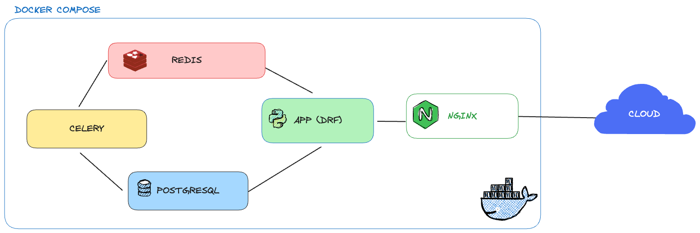

# Catalog System

## Description of the task

Basic catalog system to manage products, implemented via a REST API using Djagno Rest Framework.

- Product should have basic info such as sku, name, price and brand.

Two type of users:

- (i) admins to create / update / delete products and to create / update / delete other admins.
- (ii) anonymous users who can only retrieve products information but can't make changes.

Whenever an admin user makes a change in a product (for example, if a price is adjusted), we need to notify all other admins about the change, either via email or other mechanism.

It keeps track of the number of times every single product is queried by an anonymous user.

## Architecture overview

- **App**: The core application, built with Django Rest Framework, handles the API endpoints, business logic, and data validation. It interacts with other components in the architecture.
- **Celery**: An asynchronous task queue used for handling background jobs and scheduling tasks. It allows the system to offload long-running processes, such as sending emails.
- **PostgreSQL**: Open-source relational database used for storing and managing the application's structured data.
- **Redis**: Facilitates communication between different components through its pub/sub capabilities, enhancing the application's performance and scalability.
- **Nginx**: Improves the overall reliability and scalability of the system by efficiently distributing incoming traffic and handling SSL termination.



## Commands

Start commands:

```sh
docker compose up
```

Development commands:

```sh
docker compose exec app python manage.py makemigrations

docker compose exec app python manage.py migrate

docker compose exec app pip freeze > requirements.txt
```

Lint commands

```sh
docker compose exec app black .

docker compose exec app isort . --profile black
```
